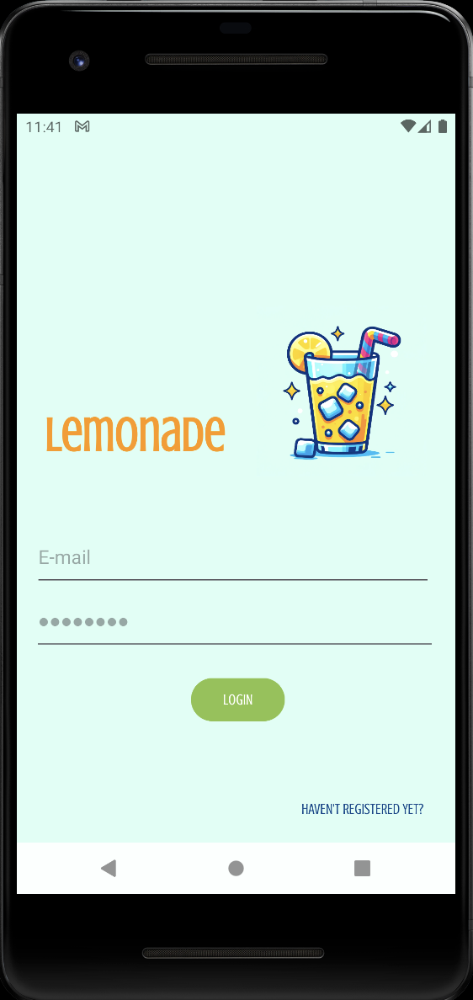
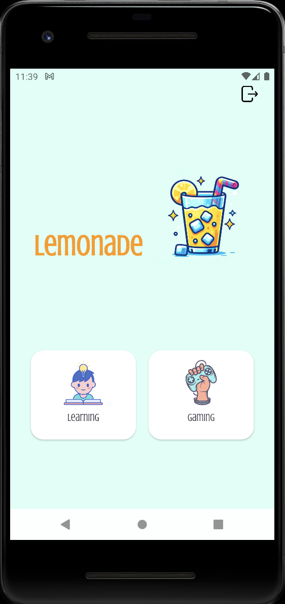
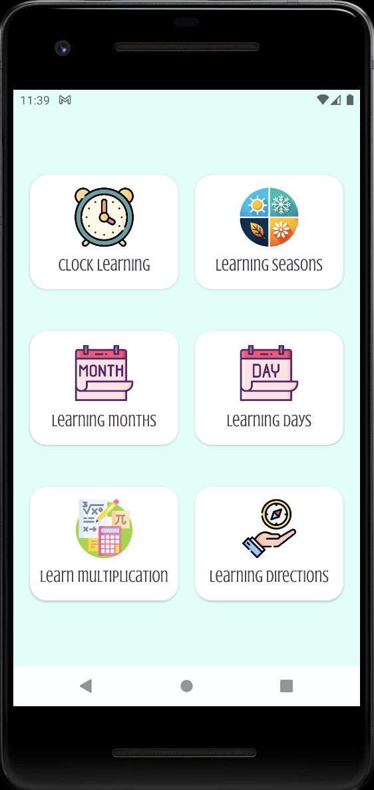
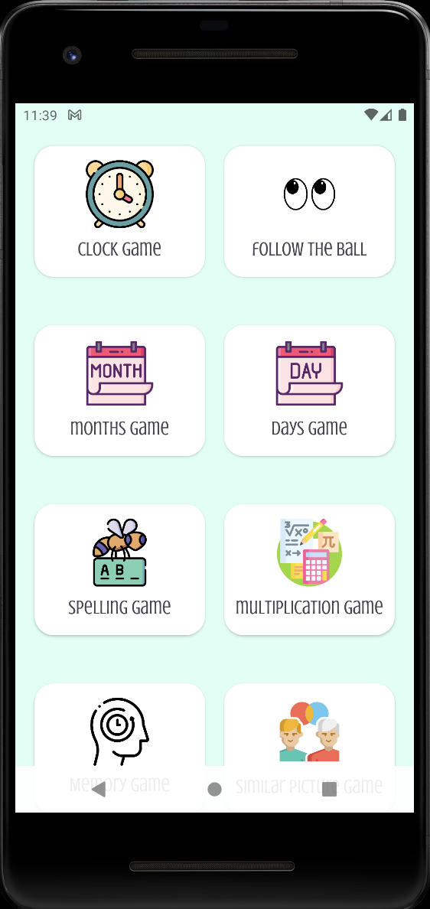

# Lemonade: An Application for Kids 🍋

**Lemonade** is a mobile application designed for kids.  
It was developed by **Asya Genç**, **Elif Oskanbaş**, and **Ulaş Deniz Karadağ**.

---

## Registration and Account

To access the Lemonade application, users must create an account by registering with an **email** and a **password**. The user's information is stored in **Firebase**.

- If a user already has an account, they can press **"Already Registered?"** at the bottom right of the page to go to the login page.

---

## Key Features (Main Menu)

The application is structured around a **Main Menu** which provides the user with two main options: **Learning** and **Gaming**.

---

## Learning Menu

The Learning section is designed for kids to improve their knowledge or learn basic concepts for adapting to real life.

It includes the following topics:

- **Clock Learning**: Users are taught to read time on both analog and digital clocks.  
- **Learning Seasons**: Users become familiar with seasons through their distinctive features.  
- **Learning Months**: Users learn months sequentially.  
- **Learning Days**: Users learn the days of the week.  
- **Learn Multiplication**: Users learn multiplication using a multiplication table.  
- **Learning Directions**: Users are taught directions with innovative features.

---

## Gaming Menu

The Gaming section allows kids to test their skills and knowledge by playing innovative games.

The games in this menu help users:

- **Enhance Focusing Skills**: With the help of **Follow the Ball**, **Spelling**, and **Memory Games**.  
- **Improve Mathematical Skills**: By playing the **Multiplication Game**.  
- **Learn Real-Life Concepts**: With the assistance of the **Clock**, **Months**, and **Days Games**.

**Available Games:**
- Clock Game  
- Follow the Ball  
- Months Game  
- Days Game  
- Spelling Game  
- Multiplication Game  
- Memory Game  
- Similar Picture Game
